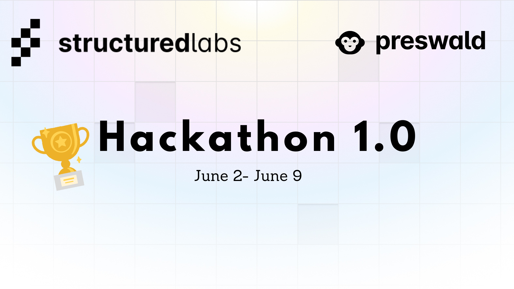

# 🧠 Preswald Data App Hackathon

Welcome to the **Preswald Data App Hackathon**—your opportunity to transform Python scripts into interactive, shareable data applications using Preswald's innovative platform. Whether you're a data scientist, analyst, or developer, this hackathon is your chance to showcase your skills and creativity.

## 🚀 What is Preswald?

Preswald is a static-site generator that allows you to build interactive data apps in Python. It packages compute, data access, and UI into self-contained apps that run locally in the browser. Built on a WASM runtime with Pyodide and DuckDB, Preswald enables portable, file-based apps that are fast, reactive, and shareable.

### 🔑 Key Features

- **Code-based development:** Write apps in Python without needing JavaScript frameworks.  
- **File-first approach:** One command creates a fully-packaged `.html` app.  
- **Built-in UI components:** Utilize tables, charts, forms, and more.  
- **Reactive engine:** Efficiently updates only what's necessary.  
- **Local execution:** Runs offline, even with large datasets.  
- **AI-ready:** Apps are fully inspectable and modifiable by agents.  

## 🌍 Hackathon Theme: *"Data Apps for Impact"*

Create interactive data applications that provide insights, solve problems, or tell compelling stories. Your app should be built using Preswald and can focus on areas such as:

- Public health data visualization  
- Financial dashboards  
- Educational tools  
- Environmental monitoring  
- Any domain where data can drive impact  

## 🛠️ Tech Stack

Participants are required to use **Preswald** as the core framework. You can integrate additional tools and libraries as needed, such as:

- **Data sources:** CSV, JSON, APIs  
- **Visualization:** Plotly, Matplotlib  
- **Data processing:** Pandas, NumPy  
- **AI/ML models:** TensorFlow, scikit-learn  

## 📅 Timeline

- **Registration Opens:** May 30, 2025  
- **Hackathon Starts:** June 2, 2025  
- **Submission Deadline:** June 9, 2025  
- **Judging Period:** June 10, 2025  
- **Winners Announced:** June 11, 2025  

## 🏆 Prizes

- 🥇 **First Place:** $100 + Feature on Preswald's official blog  
- 🥈 **Second Place:** $50 + Exclusive Preswald swag  
- 🥉 **Third Place:** $25 + Social media spotlight  
- 🎖️ **Honorable Mentions:** Recognition certificates  

## 📩 How to Participate

1. **Register:** Sign up on our hackathon page.  
2. **Build:** Develop your data app using Preswald.  
3. **Submit:** Provide a link to your GitHub repository and a brief demo video (max 5 minutes).  

## 👩‍⚖️ Judging Criteria

- **Innovation:** Originality and creativity of the application.  
- **Functionality:** How well the app performs its intended purpose.  
- **User Experience:** Ease of use and design aesthetics.  
- **Impact:** Potential real-world application and usefulness.  
- **Code Quality:** Cleanliness, documentation, and best practices.  

## 🤝 Get Involved

Interested in mentoring, sponsoring, or partnering? Reach out to us at **[avani@structuredlabs.com](mailto:avani@structuredlabs.com)**.

## 📣 Spread the Word

Share your journey and creations on social media using the hashtag **#PreswaldHackathon**.
